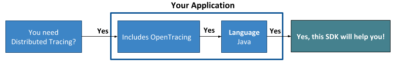

# wavefront-opentracing-sdk-java 
[![build status][ci-img]][ci] [![Released Version][maven-img]][maven] [](http://opentracing.io)

## Table of Content
* [Prerequisites](#Prerequisites)
* [Usage](#Usage)
  * [Application Tags](#1-Set-Up-Application-Tags)
  * [WavefrontSender](#2-Set-Up-a-WavefrontSender)
  * [Reporter](#3-Set-Up-a-Reporter)
  * [WavefrontTracer](#4-Create-a-WavefrontTracer) 
* [Span Logs](#Span-Logs)
* [Cross Process Context Propagation](#Cross-Process-Context-Propagation)
* [RED Metrics](#RED-Metrics)
* [Monitoring the SDK](#Monitoring-the-SDK)
* [License](#License)
* [How to Contribute](#How-to-Contribute)

# Welcome to Wavefront's OpenTracing Java SDK
This is the Wavefront by VMware OpenTracing SDK for Java that provides distributed tracing support for Wavefront.

The Wavefront OpenTracing SDK for Java automatically reports JVM metrics, custom trace data, and derived metrics. You can display the JVM metrics in a chart using the query `ts(app-agent.jvm.*)`.

**Before you start implementing, let us make sure you are using the correct SDK!**



> ***Note***:
> </br>
>   * **This is the Wavefront by VMware OpenTracing SDK for Java!**
>   If this SDK is not what you were looking for, see the [table](#wavefront-sdks) given below.
>   * Don't want to write code to instrument your application? Use the [Wavefront Java Tracing Agent](https://github.com/wavefrontHQ/wavefront-opentracing-bundle-java).
>   * See <a href="https://docs.wavefront.com/tracing_instrumenting_frameworks.html">instrument your application for tracing</a> for more information.

#### Wavefront SDKs
<table id="SDKlevels" style="width: 100%">
<tr>
  <th width="10%">SDK Type</th>
  <th width="45%">SDK Description</th>
  <th width="45%">Supported Languages</th>
</tr>

<tr>
  <td><a href="https://docs.wavefront.com/wavefront_sdks.html#sdks-that-instrument-frameworks">OpenTracing SDK</a></td>
  <td align="justify">Implements the OpenTracing specification. Lets you define, collect, and report custom trace data from any part of your application code. <br>Automatically derives Rate Errors Duration (RED) metrics from the reported spans. </td> 
  <td>
    <ul>
    <li>
      <b>Java</b>: <a href ="https://github.com/wavefrontHQ/wavefront-opentracing-sdk-java">OpenTracing SDK</a> <b>|</b> <a href ="https://github.com/wavefrontHQ/wavefront-opentracing-bundle-java">Tracing Agent</a>
    </li>
    <li>
      <b>Python</b>: <a href ="https://github.com/wavefrontHQ/wavefront-opentracing-sdk-python">OpenTracing SDK</a>
    </li>
    <li>
      <b>Go</b>: <a href ="https://github.com/wavefrontHQ/wavefront-opentracing-sdk-go">OpenTracing SDK</a>
    </li>
    <li>
      <b>.Net/C#</b>: <a href ="https://github.com/wavefrontHQ/wavefront-opentracing-sdk-csharp">OpenTracing SDK</a>
    </li>
    </ul>
  </td>
</tr>

<tr>
  <td><a href="https://docs.wavefront.com/wavefront_sdks.html#sdks-for-collecting-metrics-and-histograms">Metrics SDK</a></td>
  <td align="justify">Implements a standard metrics library. Lets you define, collect, and report custom business metrics and histograms from any part of your application code.   </td> 
  <td>
    <ul>
    <li>
    <b>Java</b>: <a href ="https://github.com/wavefrontHQ/wavefront-dropwizard-metrics-sdk-java">Dropwizard</a> <b>|</b> <a href ="https://github.com/wavefrontHQ/wavefront-runtime-sdk-jvm">JVM</a>
    </li>
    <li>
    <b>Python</b>: <a href ="https://github.com/wavefrontHQ/wavefront-pyformance">Pyformance SDK</a>
    </li>
    <li>
    <b>.Net/C#</b>: <a href ="https://github.com/wavefrontHQ/wavefront-appmetrics-sdk-csharp">App Metrics SDK</a>
    </li>
    </ul>
  </td>
</tr>

<tr>
  <td><a href="https://docs.wavefront.com/wavefront_sdks.html#sdks-that-instrument-frameworks">Framework SDK</a></td>
  <td align="justify">Reports predefined traces, metrics, and histograms from the APIs of a supported app framework. Lets you get started quickly with minimal code changes.</td>
  <td>
    <ul>
    <li><b>Java</b>:
    <a href="https://github.com/wavefrontHQ/wavefront-dropwizard-sdk-java">Dropwizard</a> <b>|</b> <a href="https://github.com/wavefrontHQ/wavefront-gRPC-sdk-java">gRPC</a> <b>|</b> <a href="https://github.com/wavefrontHQ/wavefront-jaxrs-sdk-java">JAX-RS</a> <b>|</b> <a href="https://github.com/wavefrontHQ/wavefront-jersey-sdk-java">Jersey</a></li>
    <li><b>.Net/C#</b>: 
    <a href="https://github.com/wavefrontHQ/wavefront-aspnetcore-sdk-csharp">ASP.Net core</a> </li>
    <!--- [Python](wavefront_sdks_python.html#python-sdks-that-instrument-frameworks) --->
    </ul>
  </td>
</tr>

<tr>
  <td><a href="https://docs.wavefront.com/wavefront_sdks.html#sdks-for-sending-raw-data-to-wavefront">Sender SDK</a></td>
  <td align="justify">Lets you send raw values to Wavefront for storage as metrics, histograms, or traces, e.g., to import CSV data into Wavefront. 
  </td>
  <td>
    <ul>
    <li>
    <b>Java</b>: <a href ="https://github.com/wavefrontHQ/wavefront-sdk-java">Sender SDK</a>
    </li>
    <li>
    <b>Python</b>: <a href ="https://github.com/wavefrontHQ/wavefront-sdk-python">Sender SDK</a>
    </li>
    <li>
    <b>Go</b>: <a href ="https://github.com/wavefrontHQ/wavefront-sdk-go">Sender SDK</a>
    </li>
    <li>
    <b>.Net/C#</b>: <a href ="https://github.com/wavefrontHQ/wavefront-sdk-csharp">Sender SDK</a>
    </li>
    <li>
    <b>C++</b>: <a href ="https://github.com/wavefrontHQ/wavefront-sdk-cpp">Sender SDK</a>
    </li>
    </ul>
  </td>
</tr>

</tbody>
</table> 
 
## Prerequisites

* Java 8 or above.
* If you are using Maven, add the following maven dependency to your `pom.xml` file:
    ```
    <dependency>
      <groupId>com.wavefront</groupId>
      <artifactId>wavefront-opentracing-sdk-java</artifactId>
      <version>$releaseVersion</version>
    </dependency>
    ```
    Replace `$releaseVersion` with the latest version available on [maven](http://search.maven.org/#search%7Cga%7C1%7Cwavefront-opentracing-sdk-java).

## Usage
[Tracer](https://github.com/opentracing/specification/blob/master/specification.md#tracer) is an OpenTracing [interface](https://github.com/opentracing/opentracing-java#initialization) for creating spans and propagating them across arbitrary transports.

This SDK provides a `WavefrontTracer` to create spans and send them to Wavefront. The `WavefrontTracer` also automatically generates and reports [RED metrics](https://github.com/wavefrontHQ/wavefront-opentracing-sdk-java/blob/master/docs/metrics.md) from your spans.

Follow these steps to create a `WavefrontTracer`:
1. [Create an `ApplicationTags` instance](#1-Set-Up-Application-Tags), to specify metadata about your application.
2. [Create a `WavefrontSender` instance](#2-Set-Up-a-WavefrontSender) to send trace data to Wavefront.
3. [Create a `WavefrontSpanReporter` instance](#3-Set-Up-a-Reporter) to report trace data to Wavefront.
4. [Create the `WavefrontTracer` instance](#4-Create-a-WavefrontTracer).

The following code sample creates a Tracer. For details on each step, see the sections below.

```java
Tracer createWavefrontTracer(String application, String service) throws IOException {
  // Step 1. Create ApplicationTags. 
  ApplicationTags applicationTags = new ApplicationTags.Builder(application, service).build();
  
  // Step 2. Create a WavefrontSender for sending trace data via a Wavefront proxy.
  //         Assume you have installed and started the proxy on <proxyHostname>.
  WavefrontSender wavefrontSender = new WavefrontProxyClient.Builder(<proxyHostname>).
        metricsPort(2878).tracingPort(30000).build();
        
  // Step 3. Create a WavefrontSpanReporter for reporting trace data that originates on <sourceName>.
  Reporter wfSpanReporter = new WavefrontSpanReporter.Builder().
        withSource(<sourceName>).build(wavefrontSender);
        
  // Step 4. Create the WavefrontTracer.
  return new WavefrontTracer.Builder(wfSpanReporter, applicationTags).build();
}
```


### 1. Set Up Application Tags

Application tags describe the structure of your application. They are included with every span reported to Wavefront and are associated with span tags that you can use to filter and query trace data in Wavefront.

You encapsulate application tags in an `ApplicationTags` object.
See [Instantiating ApplicationTags](https://github.com/wavefrontHQ/wavefront-sdk-doc-sources/blob/master/java/applicationtags.md#application-tags) for details.

### 2. Set Up a WavefrontSender

A `WavefrontSender` object implements the low-level interface for sending data to Wavefront. You can choose to send data using the [Wavefront proxy](https://docs.wavefront.com/proxies.html) or [direct ingestion](https://docs.wavefront.com/direct_ingestion.html).

* If you have already set up a `WavefrontSender` for another SDK that runs in the same Java Virtual Machine (JVM), use that one. For details about sharing a `WavefrontSender` instance, see [Share a WavefrontSender](https://github.com/wavefrontHQ/wavefront-sdk-doc-sources/blob/master/java/wavefrontsender.md#Share-a-WavefrontSender).

* Otherwise, [set up a WavefrontSender](https://github.com/wavefrontHQ/wavefront-sdk-doc-sources/blob/master/java/wavefrontsender.md#wavefrontsender).

### 3. Set Up a Reporter
You must create a `WavefrontSpanReporter` to report trace data to Wavefront. Optionally, you can create a `CompositeReporter` to send data to Wavefront and to print data to the console.

#### Create a WavefrontSpanReporter
To build a `WavefrontSpanReporter`, you must specify a `WavefrontSender`. Optionally, you can specify a string that represents the source for the reported spans. If you omit the source, the host name is automatically used.

Example: Create a `WavefrontSpanReporter`:

```java
// Create a WavefrontProxyClient or WavefrontDirectIngestionClient
WavefrontSender sender = buildWavefrontSender(); // pseudocode; see above

Reporter wfSpanReporter = new WavefrontSpanReporter.Builder().
  withSource("wavefront-tracing-example"). // optional nondefault source name
  build(sender);

//  To get the number of failures observed while reporting
int totalFailures = wfSpanReporter.getFailureCount();
```
>**Note:** After you initialize the `WavefrontTracer` with the `WavefrontSpanReporter` (below), completed spans are automatically reported to Wavefront.
>You do not need to start the reporter explicitly.


#### Create a CompositeReporter (Optional)

A `CompositeReporter` enables you to chain a `WavefrontSpanReporter` to another reporter, such as a `ConsoleReporter`. A console reporter is useful for debugging.

```java
// Create a console reporter that reports span to stdout
Reporter consoleReporter = new ConsoleReporter(<sourceName>); // Specify the same source you used for the WavefrontSpanReporter

// Instantiate a composite reporter composed of a console reporter and a WavefrontSpanReporter
Reporter compositeReporter = new CompositeReporter(wfSpanReporter, consoleReporter);

```

### 4. Create a WavefrontTracer
To create a `WavefrontTracer`, you pass the `ApplicationTags` and `Reporter` instances you created above to a Builder:

```java
ApplicationTags appTags = buildTags(); // pseudocode; see above
Reporter wfSpanReporter = buildReporter();  // pseudocode; see above
WavefrontTracer.Builder wfTracerBuilder = new WavefrontTracer.Builder(wfSpanReporter, appTags);
// Optionally configure sampling and add multi-valued span tags before building
Tracer tracer = wfTracerBuilder.build();
```

#### Sampling (Optional)
Optionally, you can apply one or multiple sampling strategies to the `WavefrontTracer`. See the [sampling documentation](https://github.com/wavefrontHQ/wavefront-opentracing-sdk-java/blob/master/docs/sampling.md) for details.

#### Multi-valued Span Tags (Optional)
Optionally, you can add metadata to OpenTracing spans in the form of multi-valued tags. The `WavefrontTracer` builder supports different methods to add those tags.

```java
// Construct WavefrontTracer.Builder instance
WavefrontTracer.Builder wfTracerBuilder = new WavefrontTracer.Builder(...);

// Add individual tag key value
wfTracerBuilder.withGlobalTag("env", "Staging");

// Add a map of tags
wfTracerBuilder.withGlobalTags(new HashMap<String, String>() {{ put("severity", "sev-1"); }});

// Add a map of multivalued tags since Wavefront supports repeated tags
wfTracerBuilder.withGlobalMultiValuedTags(new HashMap<String, Collection<String>>() {{
     put("location", Arrays.asList("SF", "NY", "LA")); }});

// Construct Wavefront opentracing Tracer
Tracer tracer = wfTracerBuilder.build();
```

#### Close the Tracer
Always close the tracer before exiting your application to flush all buffered spans to Wavefront.
```java
tracer.close();
```

## Span Logs 

You can instrument your application to emit logs or events with spans, and examine them from the [Wavefront Tracing UI](https://docs.wavefront.com/tracing_ui_overview.html#drill-down-into-spans-and-view-metrics-and-span-logs).

Use the [OpenTracing Span object’s log() method](https://javadoc.io/doc/io.opentracing/opentracing-api/latest/io/opentracing/Span.html#log-java.lang.String-) in your application.

## Cross Process Context Propagation
See the [context propagation documentation](https://github.com/wavefrontHQ/wavefront-opentracing-sdk-java/tree/master/docs/contextpropagation.md) for details on propagating span contexts across process boundaries.

## RED Metrics
See the [RED metrics documentation](https://github.com/wavefrontHQ/wavefront-opentracing-sdk-java/blob/master/docs/metrics.md) for details on the out-of-the-box metrics and histograms that are provided.

## Monitoring the SDK
See the [diagnostic metrics documentation](https://github.com/wavefrontHQ/wavefront-opentracing-sdk-java/tree/master/docs/internal_metrics.md) for details on the internal metrics that this SDK collects and reports to Wavefront.

## License
[Apache 2.0 License](LICENSE).

## How to Contribute

* Reach out to us on our public [Slack channel](https://www.wavefront.com/join-public-slack).
* If you run into any issues, let us know by creating a GitHub issue.


[ci-img]: https://travis-ci.com/wavefrontHQ/wavefront-opentracing-sdk-java.svg?branch=master
[ci]: https://travis-ci.com/wavefrontHQ/wavefront-opentracing-sdk-java
[maven-img]: https://img.shields.io/maven-central/v/com.wavefront/wavefront-opentracing-sdk-java.svg?maxAge=604800
[maven]: http://search.maven.org/#search%7Cga%7C1%7Cwavefront-opentracing-sdk-java
